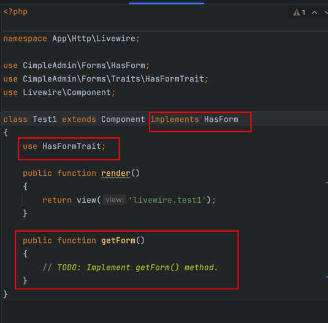

## livewire 表单构造器

这是一个基于 [livewire](https://laravel-livewire.com/) 的 [laravel](https://laravel.com/) 表单构造器。

前端基于 [Tailwind](https://tailwindcss.com/) 和 [daisyui](https://daisyui.com/)

### 如何使用
> 项目目前还处于开发期，变动会很大，不建议在生产环境中使用。

#### 在新项目中安装
1. 创建 laravel 项目后，安装扩展 `composer require cimple-admin/forms`
2. 安装后就可以使用 `artisan make:livewire` 命令来创建自己的组件了。
3. 实现 `HasForm` 接口，引入 `HasFormTrait`。只需实现一个方法 `getForm`
   
   
4. 这个方法返回了，一批表单组件。
```php
public function getForm()
{
    return [
        Input::make('password')->name('Password')->required()->passwordMin(10),
    ];
}
```


### 更多说明
1. 还在初期，改动很大，不要生产环境
2. 参考了很多 [https://filamentphp.com/](https://filamentphp.com/) 的逻辑，代码是否有交叉未知。